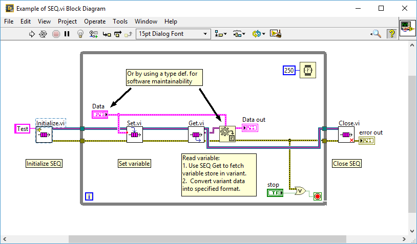

# LV-SEQ-in-variant

中文介紹：[LabVIEW 的 Single Element Queue](https://show6114.com/2018/08/29/labview-single-element-queue/)。

## Intro

This LabVIEW SEQ (Single Element Queued) variable storage provides an easy way to construct a __by referenced__ LabVIEW variable for local or global accessing. It uses _Variant_ as variable setting and accessing data type to fit most commonly usages.

Features:

* A __by reference__ variable storage
* Use _Variant_ as setter and accessor data type (typecast required to revert the original variable data type)
* The _init-set-get-close_ programming flow
* The __SEQ name__ design to identify different or the same variables.  

## Environments

Any distribution of LabVIEW 2016 or above. No add-on or module required.

## VI usage

All VIs are managed by the `SEQ.lvlib` LabVIEW Project Libraries file. The containing folder includes: 

### `Initialize.vi`

It is the initializer VI for SEQ variable. Assign a _SEQ name_ as the identity for SEQ variable. Two SEQ variable with the same _SEQ name_ share the same variable storage in same memory scope, i.e., they are the same variable. The initializer VI passed out a LabVIEW queue reference. 

### `Set.vi`

The variable setter VI. Wire any data type into the VI to assign new value to the variable storage. Because LabVIEW variant encountered low performance issue when adapting massive data. Check the _Massive data type variable issue_ section for more information.  

### `Get.vi`

The variable getter/accessor VI. Use LabVIEW's `Variant To Data` function to revert the variable from variant. 

### `Close.vi`

Wire LabVIEW queue reference into this VI to destroy the SEQ variable and release the memory space.

## Example

Please check the VI: `Example of SEQ.vi`.

## Massive data type variable issue

Try NOT to use large size data as SEQ variables. Users can reconstruct this LabVIEW library to fit into your application with a fixed data input/output type. It is also unnecessary to revert the variable data type by the `Variant To Data` function from variant.
